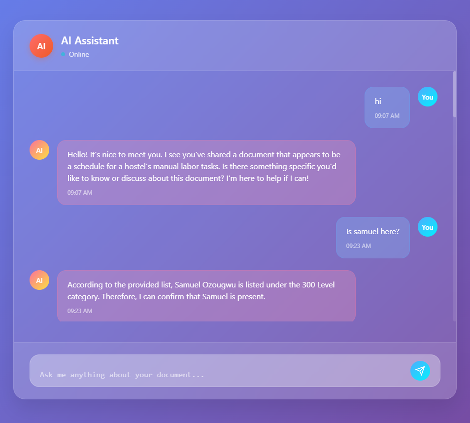

# 🧠📚 Modular RAG Pipeline — Powered by FastAPI + LangChain

Welcome to the **RAG (Retrieval-Augmented Generation)** project!

This is a modular and scalable system built to handle document ingestion, vector search, memory-powered interactions, and custom prompts — all wrapped in a FastAPI interface with a user-friendly frontend.

> ⚙️ Built for speed, flexibility, and production-grade applications.



---

## 🚀 Features

- 📄 Upload and process PDF documents  
- ✂️ Chunk documents and embed them using HuggingFace models  
- 🧠 Vector store powered by FAISS  
- 🔁 Conversational memory with LangChain's `ConversationBufferMemory`  
- ⚙️ Dynamic RAG pipeline powered by **Groq + LLaMA 3** (blazing fast inference)  
- 🌐 REST API and simple HTML frontend via **FastAPI**  
- 📬 Query your documents and get relevant, context-aware answers  
- 💬 Customizable system prompts (coming soon)

---

## ✅ Current Progress

The core system includes:

- ✅ LangChain with Groq’s LLaMA 3 LLM  
- ✅ HuggingFace sentence-transformers (`all-MiniLM-L6-v2`) for document embeddings  
- ✅ FAISS for in-memory vector storage  
- ✅ Conversational memory (chat history preserved across queries)  
- ✅ Document upload and question-answering from PDFs  
- ✅ FastAPI backend with a basic but functional HTML UI  

---

## 🧪 Example Usage

```python
from pathlib import Path
from rag_pipeline import RagPipeline

# Initialize the pipeline
pipeline = RagPipeline()

# Process a PDF and prepare the QA chain
qa_chain = pipeline.run_pipeline(Path("example.pdf"))

# Ask a question
response = qa_chain.run("What is this document about?")
print(response)
